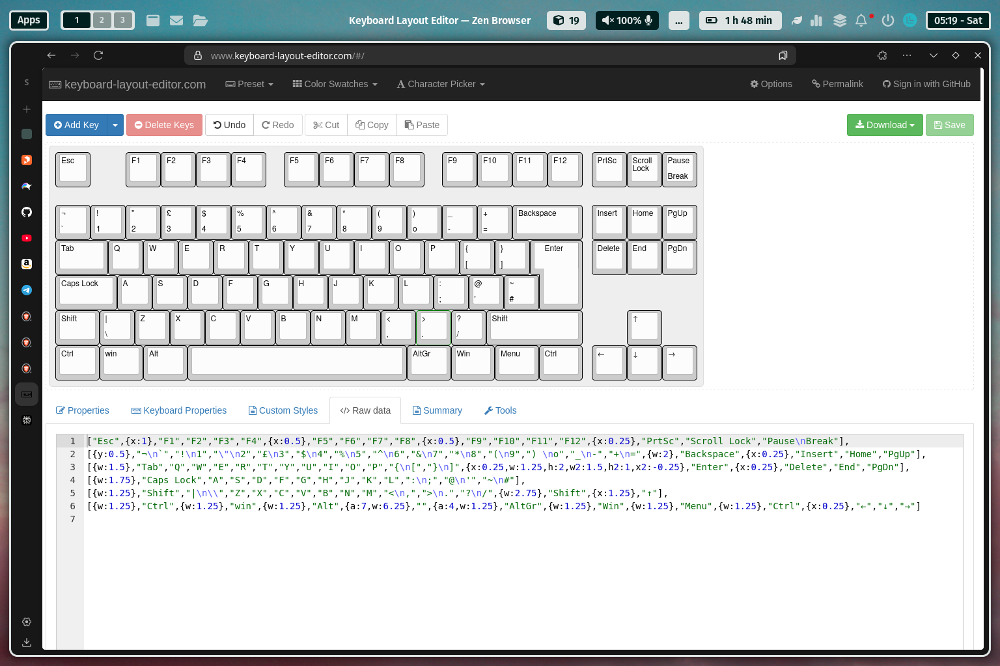
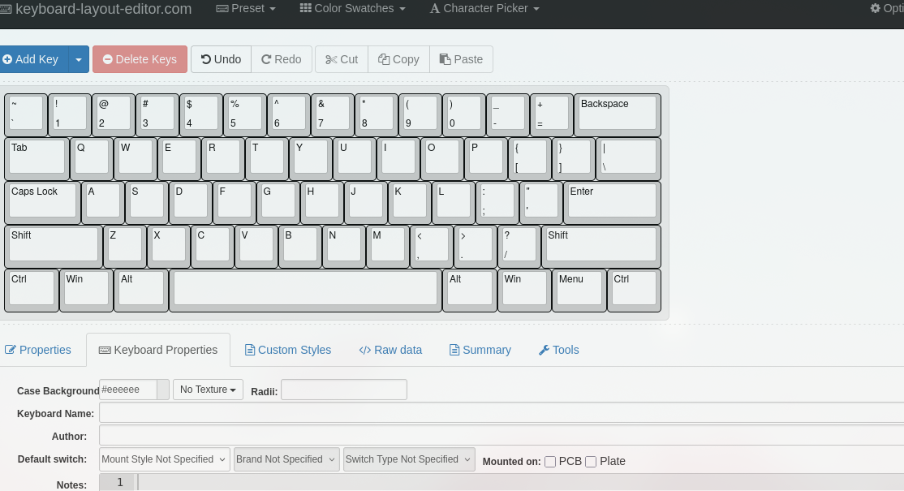
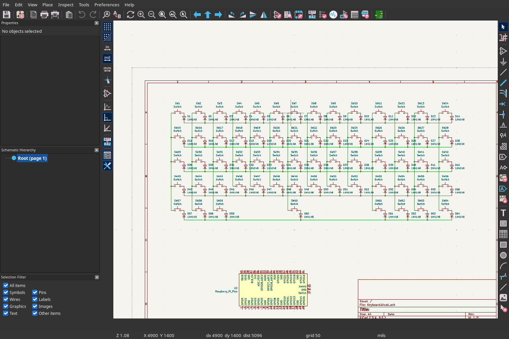
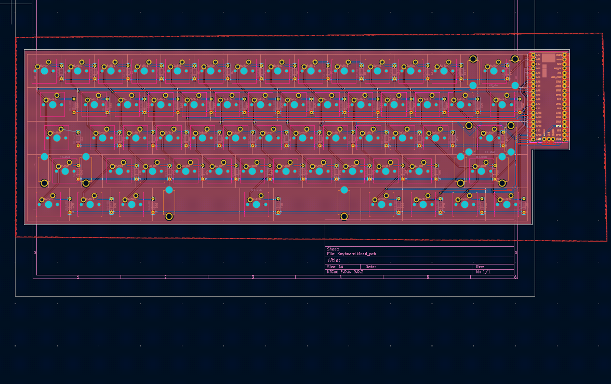
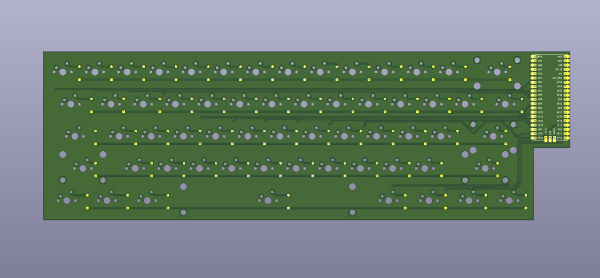
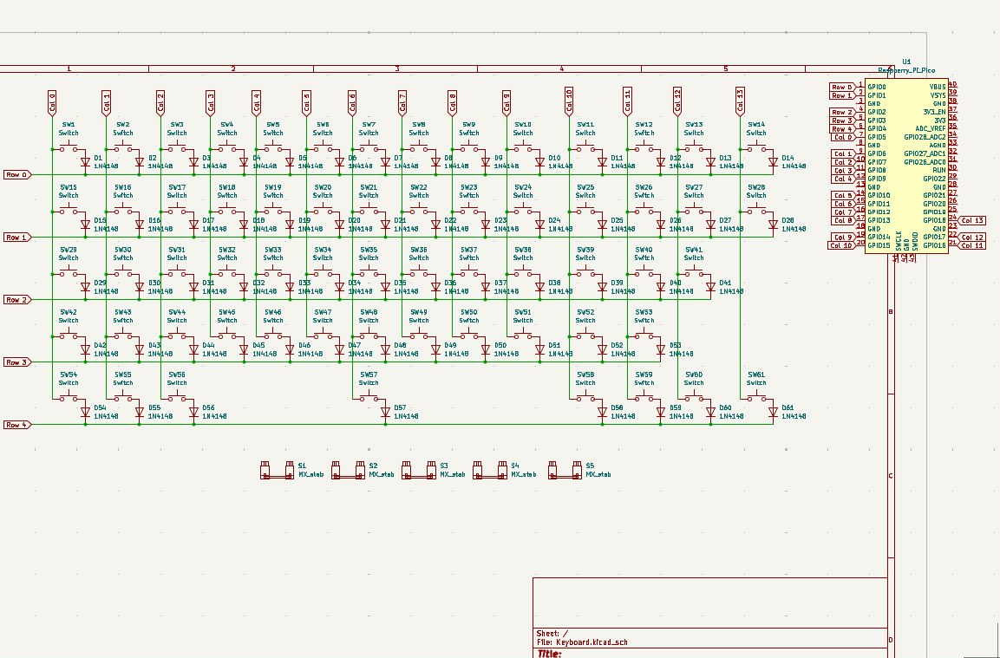
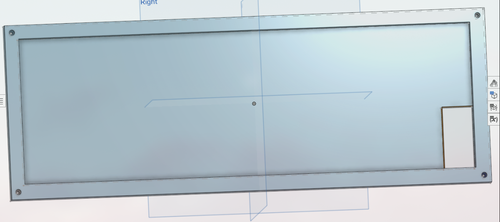
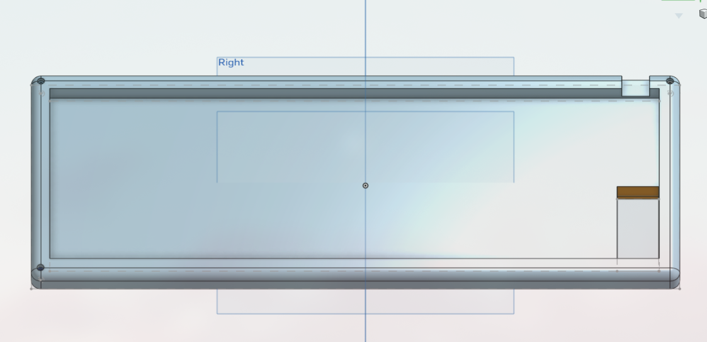
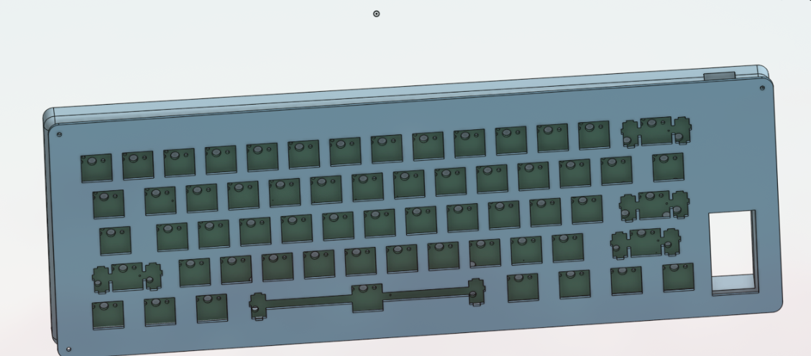
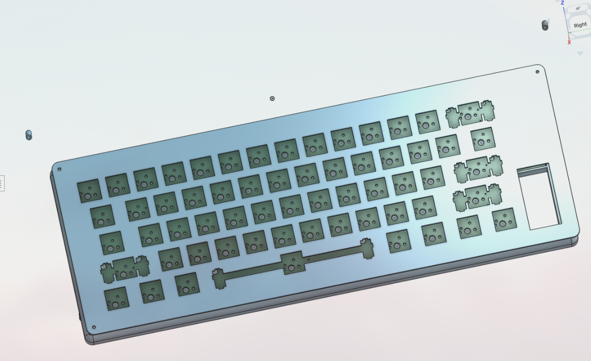

**June13**

- finalized that i will be using RP2040 for this project and decided that i won't add any knob or display, i will use cherry mx brown switches for this keyboard.
- I want to keep it a simple keyboard which does it's job.

---

**June14**

- Created the repository
- I will start by creating the layout of the keyboard on the website.
- Completed the layout :

- I rechanged the layout to the default us based qwerty type, because i personally didn.t liked the previous one that much.

- I also found the symbols and footprint for my MCU that will RP2040 plus and Cherry MX brown Switches, i started working on the schematics only connected the switches and diodes till now 

- My goal is atleast completing the pcb in this night and start working on the CAD from that point or after a sleep.

At the end: **4-5hrs of total work**

---

**June 15**

- So i wasn't able to complete the PCB in the night and i did it right now, i will add the imges below, my next plan is building the case for it like i did thought of a design because i put the MCU on the side there is a vacant space below it and remove that space from the pcb because i'm thinking that i can make a handle type thing their which will improve it's looks too i also have to focus on proper screw placements i will propabably add only 4 screws to join the main and top body...
- I also added Text in the pcb which i forgot in the first iteration but even this is just all right, imo it looks better without any text, i mean i can add text on the case yeah just remembered i also thinking of adding PCB holders in the case like yeah i'll add image if that works.
Anyways here's the image for this projects final pcb and schematics :

- Btw i found a great plugin in Kicad which automatically arranges the Switches according the keyboard layout design just upload the json file to it, but it kinda also wires up them which i had clean because it was really messy and i let's just say it is best for arranging keys...
- ANyways Started working on the 3D case for the keyboard my plan is to keep the keyboard a bit rounded and the plate too ofc, i will also remove the bottom right part just like the pcb i'm thinking of giving it a Handle like look  from which you can grab it...
- here are is a picture of the body which i created:

- This is the not the perfect body right now i will add fillet to round the edges which will make it look good i also have to add area for connecting usb type c, need some dimensions before i do that, it should fit the pcb properly....  also  I can't see the extruded lines in the assemble page on onshape dunno why.
- My body is now finalized i added fillet almost everywhere (like in edges )which made the top case and the body look shit,  i didn't take any photos of it tho, then i removed it and added fillet on only exterior side of the body, which is now looking good, i still don't know why the i can't see the extruded line in the asseble page it is quite important part of the keyboard as it will hide the pcb from the gap...

- I have started working on the Top panel now this should be easy as we already have the dxf file for my layout, just need proper positioning and have to add screw holes...
- So a very dumb thing happend with me lol, i added the Gap just near the lines of the top panel rectangle(in sketch) i forgot that the dimensions of the top panel are of the outer base rectangle and i started thinking that i have ruined the design but i understood it later and fixed and the dimensions are now correct and fitting properly

- With that my project is almost finished now just need to make firmware which is very easy actually i never knew keyboard firware are coded on python, anyways i wasted way too much time in assembly page trying to join them together and taking photos i'm not the best in the CAD work...

- I will try complete the firmware tonight only i mean in 3 hrs it will be morning it is already 16 but not for me.. I haven't added the repo to the highway submission so i will do that right now and hopefully submit it tomorrow :).

At the end: **8+ hrs**

---

**JUlY 16**

- In night i almost completed the firmware but now in the morning i have created it all of the files are ready now i just have to find the BOM like component prices in my area create a good README and fix journal i think this should do it
- The pull request is still not accepted i think i have to wait till it gets accepted.
- Finally README done added BOM and details on it, still not accepted this is my second project but my first one didn't got approved yet, i hope this one happens a bit quicker because i have added all the things required...
- ALright everything is done ig it is ready for submission ones my pull request gets accepted i will submit it right away or i will ask in the slack for it, anyways let's hope for the best and I hope I go to undercity!!.

- Completed V1

- Ay Pull request got accepted! Time to submit I will do it after I get home... 

At the end:**3hrs**
