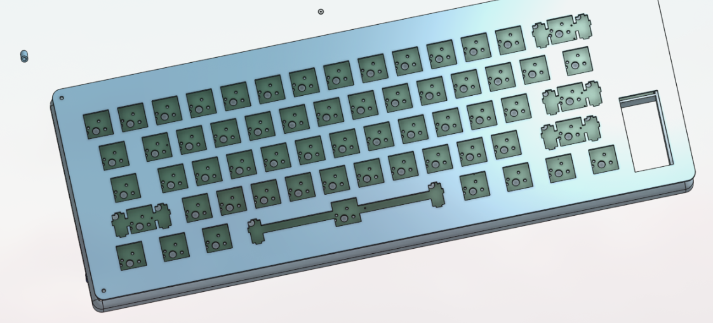
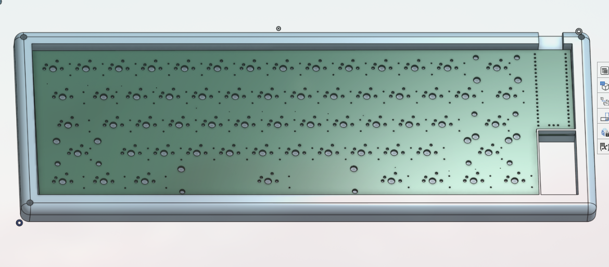
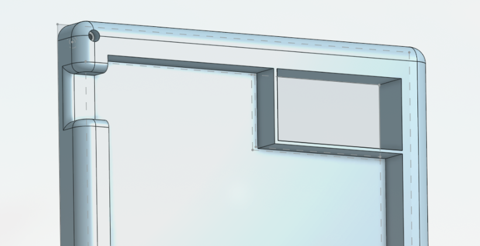
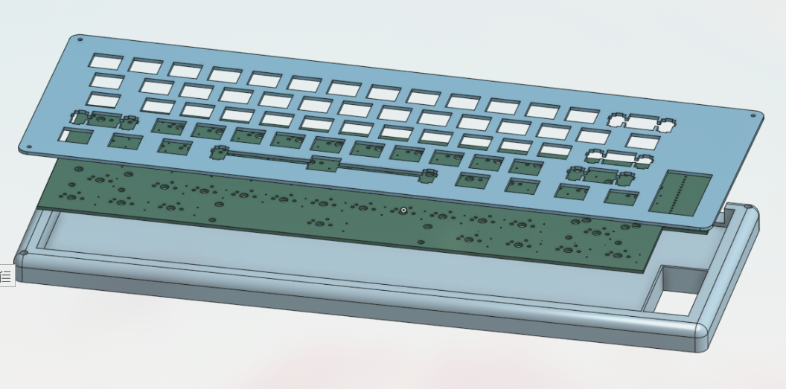
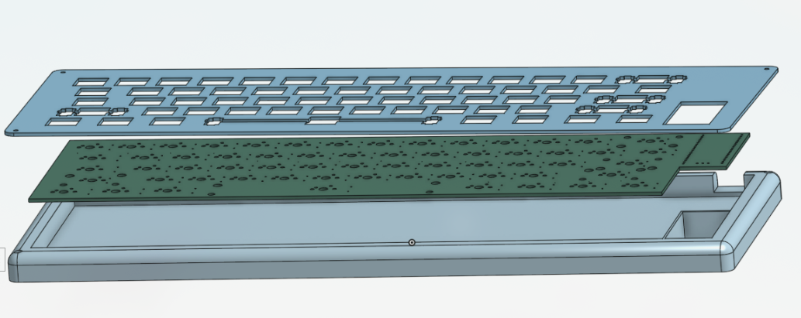

# WayBoard
A Keyboard Design for ME and YOU

## Overview
a 60% keyboard design With very minimal design, it is based on RP2040 plus with a type C port which came in-built with the MCU, there total of 61 MX switches design with 5 Stabilizer type switches. A small minimal keyboard :).

## Bit in depth info
The keyboard is designed to be sleek and plane it has RP2040 plus as the MCU and Cherry MX Brown Switches for the keys which are used for versatile purposes (that's what i saw at least). The main firmware is KMK based and the Firmware has already been released, you can find that in the Firmware and Production folder, I hate using different cables so having type c inbuilt in the RP2040 plus is a win-win. I added A small space in the bottom right of the keyboard which will act as a handle kind of things and also look good

---

## Images

---

## Files to build 

### PCB 

The files for the PCB and Schematics are available in the PCB folder and gerber files are added in the Production folder..

### 3D Case (CAD)

The step files for the keyboard are available in the CAD folder and also in the Production Folder.

Other than this you just have to purchase the Components given below and assemble them.

---

## BOM

| Component                 | Quantity | Note                                                                                    | Price                | Link                                                                                                                                                                         |
| ------------------------- | -------- | --------------------------------------------------------------------------------------- | -------------------- | ---------------------------------------------------------------------------------------------------------------------------------------------------------------------------- |
| Cherry MX Switches(Brown) | 61       | Couldn't find a proper retailer on Amazon.They are selling for the right amount i think | 43USD                | [Available](https://keychron.in/product/cherry-mx-switch-set/?attribute_pa_options=brown&attribute_pa_quantity-of-one-set=110-switches)                                      |
| White Keycaps set         | 1        | Good Asthetics are important I will keep the body grey :)                               | 40USD                | [Available](https://keychron.in/product/cherry-profile-double-shot-pbt-full-set-keycaps-black-on-white/?attribute_pa_version=full-set-219-keys&attribute_pa_colorways=white) |
| Stabilizer set            | 1        | It has 2 extra Stabilizers just in case..                                               | 23USD                | [Available](https://amzn.in/d/dM157FJ) [Available](https://amzn.in/d/5Nto8PQ)                                                                                                |
| Case & PCB                | 1        | I will make them through any local business                                             | 35-40 USD (and less) |                                                                                                                                                                              |
| TOTAL                     |          |                                                                                         | 130-140USD           |                                                                                                                                                                              |

Other than this you also need M3 srews but i didn't included them as i already have them..

---

## Extra Stuff

### Gratitude
- Thanks to Hackclub and Hackpad for making me do this brilliant project, More coming :).
- Thanks to my potato for helping me till the end.
- Thanks to myself for completing the project and not getting distracted with another project.
- And Thank you for Reading?

### Inspiration
**Going to Undercity!!**

### Challanging
The only challanging part was designing the PCB and Schematics, first i was overthinking for what MCU should i choose then i took some time on footprints and symbols..

---

## End
Check my [BLOG](https://mihranrazaa.pages.dev/)
~ mihranrazaa(If you are reading this please review HappyUSB too ToT )

BYEEE
